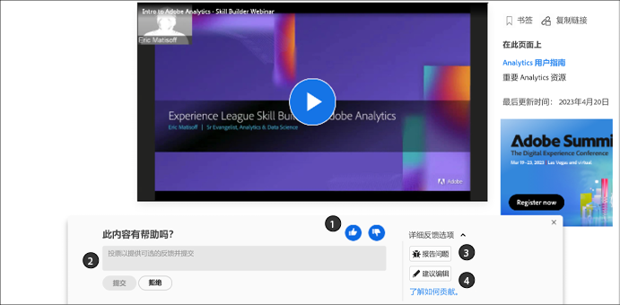
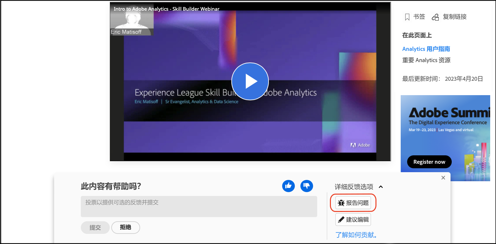

# Adobe文档参与者指南

本指南介绍如何为Adobe有关Experience League的企业帮助做出贡献。

## 什么是协作文档？

Adobe Experience Cloud和其他Adobe企业版产品的技术文档和支持内容基于使用GitHub、Markdown和Adobe Experience Cloud解决方案的开源原则。

此开源模型提高了内容质量，加强了客户、文档团队和产品团队之间的沟通。 如今，您在每个页面上都可以评价内容实用性、记录问题，甚至可以将有关的内容建议作为 Git 拉取请求 (PR) 进行投稿。Adobe 文档团队每天都在检查投送的稿件和有关问题，并且会根据需要进行更新和调整。

## 使用协作文档

作为此材料的用户，无论您是员工、合作伙伴、客户还是潜在客户，您都可以选择通过几种简单的方式为此文档投稿。

* 对页面的实用性进行评分❶并撰写可选评论❷
* 报告针对特定页面的问题（需要Git登录）❸
* 提交快速编辑到以创作整篇文章，其中包含资产和代码示例（需要Git登录）❹

这些选项会在页面打开后几秒钟显示在页面底部。 如果您关闭反馈区域，则可以重新加载页面以使其恢复。

关于如何与这类文档材料小组进行互动以及如何投稿，本指南概述了您需要了解的所有相关内容。

<!--
>[!IMPORTANT]
>All repositories that publish to docs.adobe.com have adopted the [Adobe Open Source Code of Conduct](../code-of-conduct.md) or the [.NET Foundation Code of Conduct](https://dotnetfoundation.org/code-of-conduct). For more information, see the [Contributing](../contributing.md) article.
>
> Minor corrections or clarifications to documentation and code examples in public repositories are covered by the [Adobe Documentation Terms of Use](https://www.adobe.com/legal/terms.html). New or significant changes generate a comment in the pull request, asking you to submit an online Contribution License Agreement (CLA) if you are not an employee of Adobe. We need you to complete the online form before we can review or accept your pull request.
-->

## 对页面的实用程度进行评级并撰写评论

打开页面几秒钟后，页面底部会显示一个反馈区域。 单击向上或向下以指示该页面是否有用。

欢迎您随时发表评论，以提供更多反馈。

## 对现有文档进行快速编辑

如果您想提供更详细的反馈，快速编辑是修复文档中的小错误和遗漏的好方法。 当您提出编辑建议时，可以提交拉取请求(PR)以将修复/建议提交给我们，然后我们可以审核、批准和发布建议。

1. 签署[参与者许可协议 (CLA)](http://opensource.adobe.com/cla.html)（如果接受）。

   您只需提交一次 Adobe CLA 即可。

1. 在文章底部显示的反馈区域中，单击 **[!UICONTROL Detailed feedback options]**，然后单击 **[!UICONTROL Suggest an edit]** 以转到GitHub上的Markdown源文件。

   

1. 单击铅笔图标可编辑相关文章。

   >[!NOTE]
   >
   >如果铅笔图标呈灰显状态，则表明您需要登录您的 GitHub 帐户，或创建一个新帐户。

   

1. 在 Web 编辑器中进行更改。

   您可以单击 **[!UICONTROL Preview changes]**（预览更改）选项卡以检查所做更改的格式。

1. 进行更改后，滚动到页面底部。

   输入PR的标题和描述，然后单击 **[!UICONTROL Propose file change]** 如下图所示：

   

   >[!NOTE]
   >
   >如果您收到有关签署“参与者许可协议”(CLA) 的验证错误消息，请单击 **[!UICONTROL Details]**（详细信息），以打开相关的许可协议。签署协议（如果接受）。接下来，关闭并打开拉取请求，然后继续操作。

以上就是所有步骤。文档团队成员将审核并合并您的拉取请求。谢谢！

## 报告问题

另一个向我们告知内容存在问题的简单方法是使用 **[!UICONTROL Report an issue]**.

1. 在文章底部显示的反馈区域中，单击 **[!UICONTROL Detailed feedback options]**，然后单击 **[!UICONTROL Report an issue]** 以转到GitHub上的Markdown源文件。

   

   >[!NOTE]
   >
   >要报告问题，您必须登录到GitHub帐户，或创建一个帐户。

   单击此链接可让您使用Github问题界面快速记录带有Experience League的票证。

   描述字段中会自动填充存在问题的页面的URL。

1. 填写标题，简要描述问题，然后单击 *Submit new issue*（提交新问题）。

   

提交问题会通知此页面的内容团队，以便他们解决您的问题。 更新内容后，我们会通过“Github 问题”界面通知您，并且会在内容更新或关闭时通过电子邮件通知您。

## 了解 GitHub 权限

GitHub 编辑 UI 会根据您的存储库权限自行调整。对于不具有目标存储库写入权限的参与者，前面的图像是准确的。GitHub 会自动在您的帐户中创建目标存储库分支。如果您具有目标存储库的写入权限，GitHub 会在目标存储库中创建一个新分支。

Adobe 会对所有更改使用拉取请求，甚至对于具有写入权限的参与者也是如此。大多数存储库都会保护 `main` 分支，因此必须作为拉取请求来提交更新。

浏览器内编辑体验最适用于次要或不常见的更改。如果您要进行大量更改或使用高级 Git 功能，我们建议您[创建分支存储库并在本地使用](setup/full-workflow.md)。

## 提供反馈

要设置与 Adobe 一样大型的解决方案，文档工作始终任重而道远。如果发现错误，请将问题记录下来；如果想提供有关材料的建议，请告知我们。告诉我们您需要的信息。如果您无法找到所需内容，请告知我们；或者如果您在完成任务时遇到困难，请告诉我们可以如何帮助您了解我们的解决方案。

在此，请接受“协作文档”团队及Experience League中所有作者和内容制作者的谢意。
