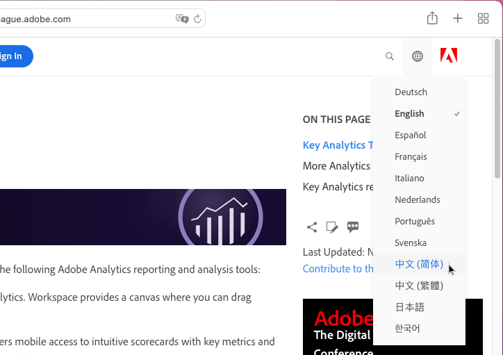
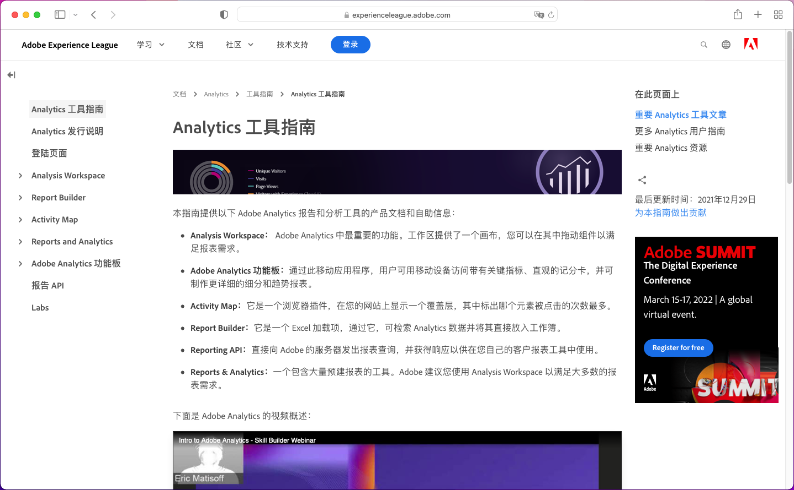
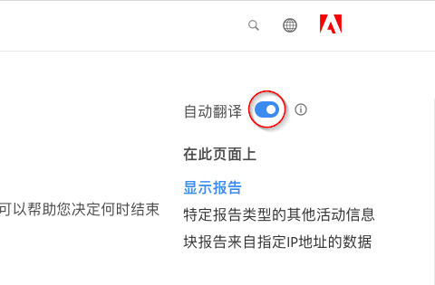
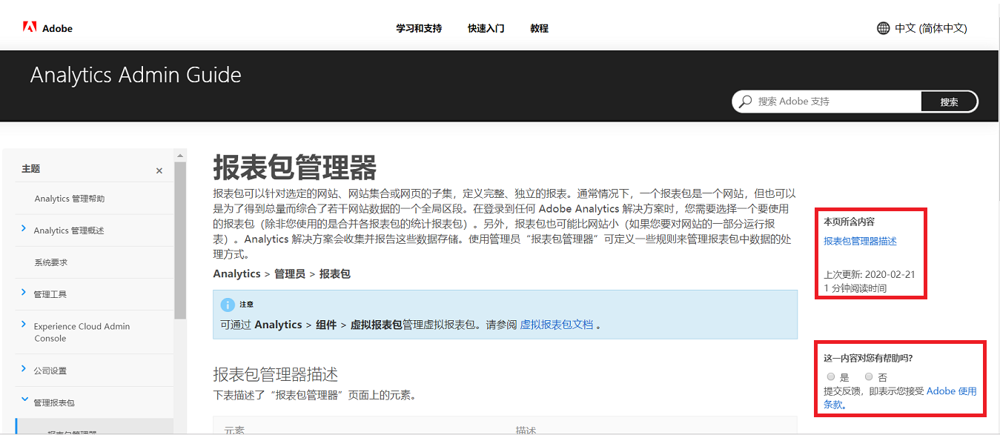

# Adobe Experience Cloud 产品文档的语言支持

Adobe 认识到，您依赖于随时准备以 Adobe 产品支持的语言提供的产品文档、帮助和支持内容。为了满足您的这一需求，Adobe 提供了独特的翻译体验，让您能够选择所需的语言，并对翻译内容的质量提供反馈。

## 选择语言

您可以查看大多数语言版本的 Adobe Experience Cloud 产品文档。

1. 导航到 Experience Cloud [产品文档](https://helpx.adobe.com/cn/support/experience-cloud.html)。

1. 浏览以查找帮助页面（例如，[Analytics](https://docs.adobe.com/content/help/zh-Hans/analytics/landing/home.html)）。

1. 单击“语言选择器”（世界图标），然后选择一种语言。

   

   页面将使用您选择的语言显示。

   

   如果尚未提供您的语言版本，Adobe 可以自动翻译您的内容。Adobe的自动翻译服务在右导航顶部显示一条消息：

   

   可以自动使用您的语言显示内容，或者，您也可以单击链接以触发翻译。（当您单击超链接从翻译页面返回到源英文页面时，可能会发生这种情况。这样您就可以根据需要选择查看翻译页面。）您随时可以返回源英文页面。

   有时候，在翻译完成之前，源英文内容可能进行了最新更新和发布。单击下拉菜单中的语言后，您会在页面顶部的浅蓝色水平栏中看到一则通知，告诉您页面是自动从前一版本翻译过来的，更新内容将于不久之后提供。如果您愿意，可以选择在新的浏览器窗口中查看最新的源英文内容。

## 为什么使用自动翻译

Adobe 利用自动翻译功能，尽可能在与内容创建时间最接近的时间发布各种语言版本的产品支持内容。由于支持内容对于产品使用至关重要，因此，我们优先考虑由技能娴熟的专业人士翻译内容，但在紧急情况下需要快速提供翻译内容时，我们可能也会选择自动翻译。

自动翻译在互联网上已经十分普遍，被公认为是一种强大的信息收集工具。自动翻译已广泛应用于知识库内容，在这一领域中，几乎不存在人为干涉。尽管近些年来在技术方面有了重大突破，但是自动生成的翻译内容在语言与意义方面仍偶尔存在不准确和错误现象。

### 通过浏览器自动翻译

如果您已将浏览器首选项设置为将任何页面自动翻译成您的语言，请注意，生成的翻译将与通过 Adobe 页面获得的翻译有所不同。这是因为浏览器提供的服务可能会存储翻译，而 Adobe 翻译将经过自定义以符合 Adobe 风格指南和术语。要获得最佳的自动翻译结果，我们建议您在浏览器首选项中禁用此特定站点的浏览器选项，或在显示时单击&#x200B;**从不翻译**。

### 已知问题

您可能偶尔会遇到自动翻译输出问题，例如，翻译不完整、字符损坏或页面布局问题。这是由 Adobe 使用的各种创作、发布或翻译技术工具造成的。我们将尽一切努力来在下面列出这些已知问题。

| **问题 ID** | **说明** | **状态** |
|--------------|-------------------------------------------------------------------------------------|------------|
| G11N3558 | 某些 Audience Manager 页面一半为英文，一半为译文（法语、西班牙语）。 | 未解决 |

### 反馈

无论内容是在默认情况下，还是在用户操作下被自动翻译，都可以选择向 Adobe 提供有关翻译的反馈。在页面顶部的浅蓝色水平栏中，您可以对“此翻译是否有用？”问题回答“是”或“否”。Adobe 会收集这一有价值的量度，并对编译后的数据进行分析，以便做出内容翻译方面的决策。我们重视您的反馈并鼓励您积极提供反馈。

将来，我们计划允许您以记录问题、提出改进建议，甚至请求其他语言的形式提供更广泛的反馈。其中一些功能已在英文页面上提供。从长远来看，我们相信这将帮助 Adobe 改善这些页面的用户体验。

<!--

-->

### 翻译免责声明

Adobe 使用机器翻译程序将文本翻译为多种不同的语言。请注意，计算机翻译采用逐字直译方式，因此可能包含错误。Adobe 不保证提供的译文的准确性、可靠性或时效性。对于因依赖已翻译信息的准确性或可靠性而造成的任何损失或损害，Adobe 概不负责。如果英语与其他语言之间存在内容差异，则以英语版本为准。

如果您要报告翻译错误或不准确性问题，我们非常欢迎您与我们联系。
